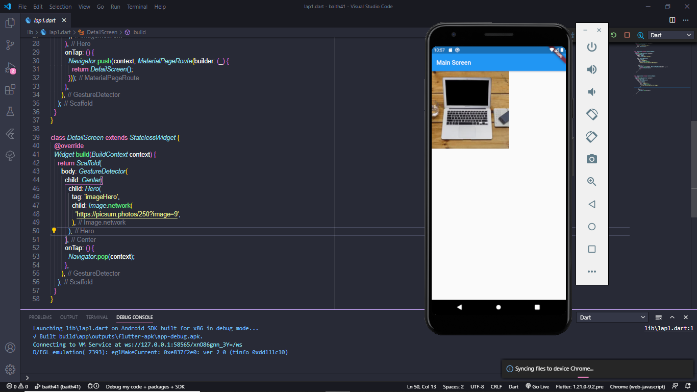
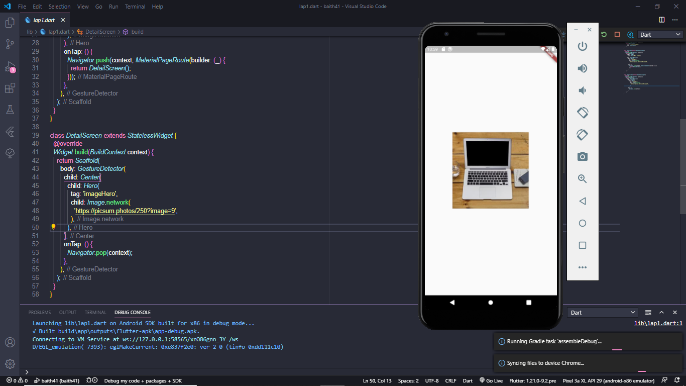
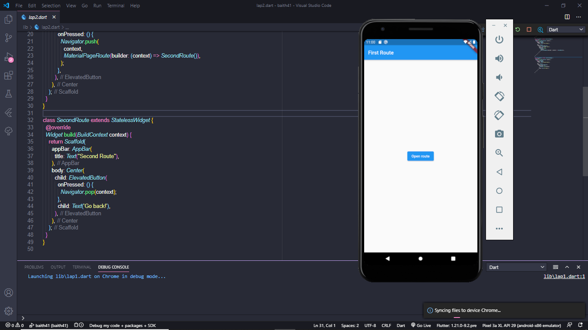
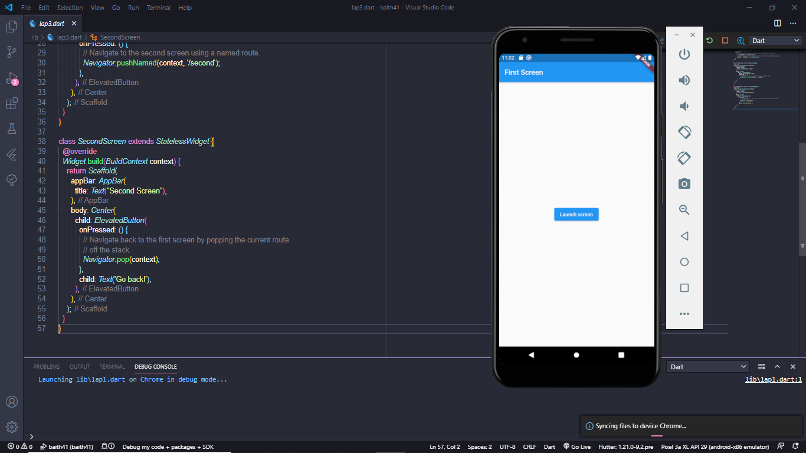
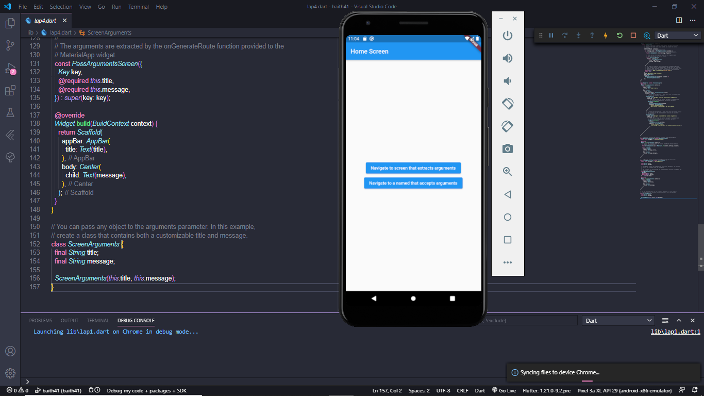
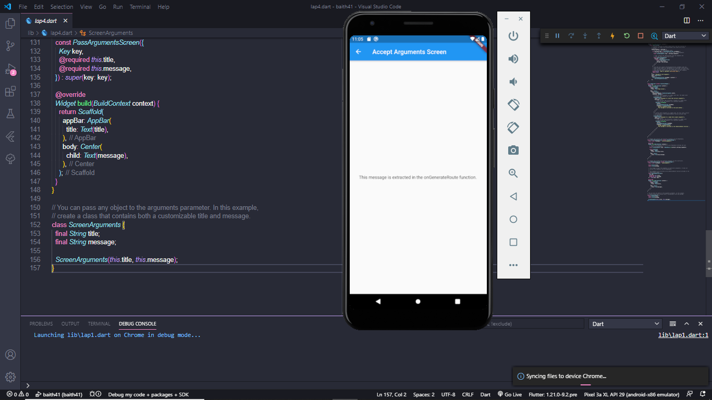
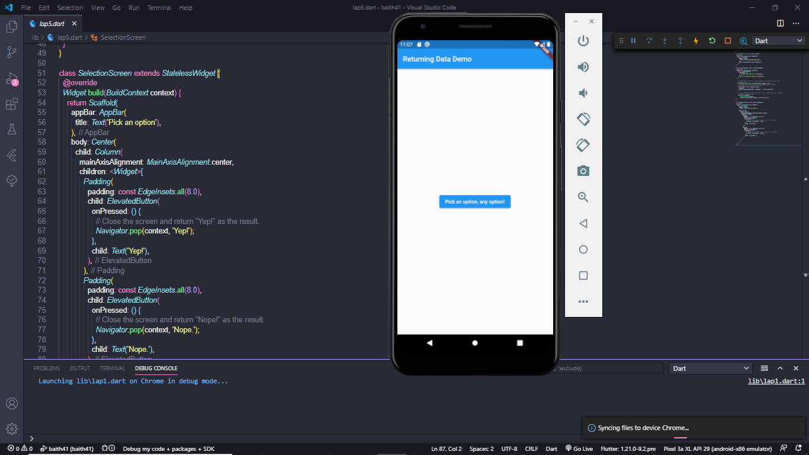
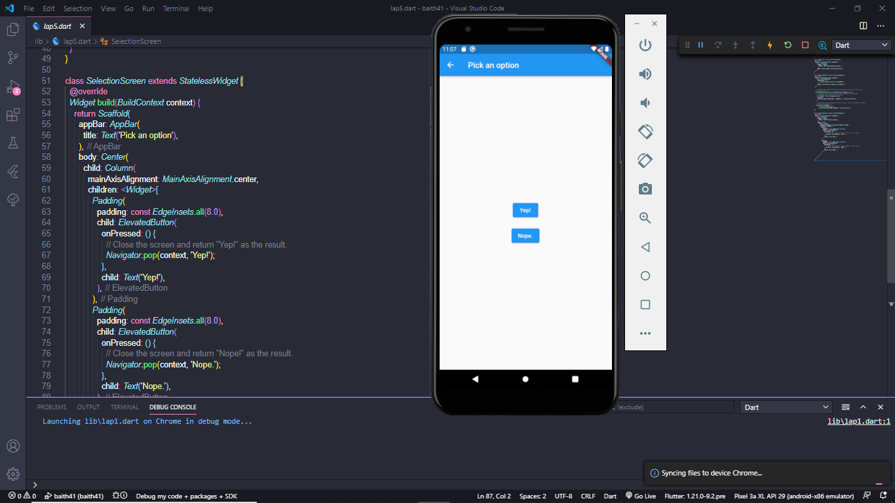
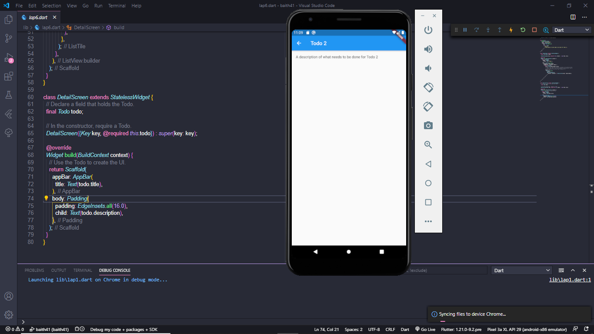

# baith41

## Bài 4.1: Điều hướng, định tuyến và truyền giữa các màn hình

### Descript **lap1.dart**: Animate a widget across screens
1. Create two screens showing the same image
1. Add a Hero widget to the first screen
1. Add a Hero widget to the second screen

### Source code **lap1.dart**: Animate a widget across screens
```
import 'package:flutter/material.dart';
void main() => runApp(HeroApp());
class HeroApp extends StatelessWidget {
  @override
  Widget build(BuildContext context) {
    return MaterialApp(
      title: 'Transition Demo',
      home: MainScreen(),
    );
  }
}
class MainScreen extends StatelessWidget {
  @override
  Widget build(BuildContext context) {
    return Scaffold(
      appBar: AppBar(
        title: Text('Main Screen'),
      ),
      body: GestureDetector(
        child: Hero(
          tag: 'imageHero',
          child: Image.network(
            'https://picsum.photos/250?image=9',
          ),
        ),
        onTap: () {
          Navigator.push(context, MaterialPageRoute(builder: (_) {
            return DetailScreen();
          }));
        },
      ),
    );
  }
}
class DetailScreen extends StatelessWidget {
  @override
  Widget build(BuildContext context) {
    return Scaffold(
      body: GestureDetector(
        child: Center(
          child: Hero(
            tag: 'imageHero',
            child: Image.network(
              'https://picsum.photos/250?image=9',
            ),
          ),
        ),
        onTap: () {
          Navigator.pop(context);
        },
      ),
    );
  }
}
```
* Result lap1.dart: 





### Descript **lap2.dart**: Navigate to a new screen and back
1. Create two routes.
1. Navigate to the second route using Navigator.push()
1. Return to the first route using Navigator.pop()
### Source code **lap2.dart**: Navigate to a new screen and back
```
import 'package:flutter/material.dart';
void main() {
  runApp(MaterialApp(
    title: 'Navigation Basics',
    home: FirstRoute(),
  ));
}
class FirstRoute extends StatelessWidget {
  @override
  Widget build(BuildContext context) {
    return Scaffold(
      appBar: AppBar(
        title: Text('First Route'),
      ),
      body: Center(
        child: ElevatedButton(
          child: Text('Open route'),
          onPressed: () {
            Navigator.push(
              context,
              MaterialPageRoute(builder: (context) => SecondRoute()),
            );
          },
        ),
      ),
    );
  }
}
class SecondRoute extends StatelessWidget {
  @override
  Widget build(BuildContext context) {
    return Scaffold(
      appBar: AppBar(
        title: Text("Second Route"),
      ),
      body: Center(
        child: ElevatedButton(
          onPressed: () {
            Navigator.pop(context);
          },
          child: Text('Go back!'),
        ),
      ),
    );
  }
}
```
* Result lap2.dart: 




### Descript **lap3.dart**: Navigate with named routes
1. Create two screens
1. Define the routes
1. Navigate to the second screen
1. Return to the first screen
### Source code **lap3.dart**: Navigate with named routes
```
import 'package:flutter/material.dart';
void main() {
  runApp(MaterialApp(
    title: 'Named Routes Demo',
    initialRoute: '/',
    routes: {
      '/': (context) => FirstScreen(),
      '/second': (context) => SecondScreen(),
    },
  ));
}
class FirstScreen extends StatelessWidget {
  @override
  Widget build(BuildContext context) {
    return Scaffold(
      appBar: AppBar(
        title: Text('First Screen'),
      ),
      body: Center(
        child: ElevatedButton(
          child: Text('Launch screen'),
          onPressed: () {
            Navigator.pushNamed(context, '/second');
          },
        ),
      ),
    );
  }
}
class SecondScreen extends StatelessWidget {
  @override
  Widget build(BuildContext context) {
    return Scaffold(
      appBar: AppBar(
        title: Text("Second Screen"),
      ),
      body: Center(
        child: ElevatedButton(
          onPressed: () {
            Navigator.pop(context);
          },
          child: Text('Go back!'),
        ),
      ),
    );
  }
}
```
* Result lap3.dart: 




### Descript **lap4.dart**: Pass arguments to a named route
1. Define the arguments you need to pass
1. Create a widget that extracts the arguments
1. Register the widget in the routes table
1. Navigate to the widget

### Source code **lap4.dart**: Pass arguments to a named route

```
import 'package:flutter/material.dart';
void main() => runApp(MyApp());
class MyApp extends StatelessWidget {
  @override
  Widget build(BuildContext context) {
    return MaterialApp(
        onGenerateRoute: (settings) {
          if (settings.name == PassArgumentsScreen.routeName) {
            final ScreenArguments args = settings.arguments;
            return MaterialPageRoute(
              builder: (context) {
                return PassArgumentsScreen(
                  title: args.title,
                  message: args.message,
                );
              },
            );
          }
          assert(false, 'Need to implement ${settings.name}');
          return null;
        },
        title: 'Navigation with Arguments',
        home: HomeScreen(),
        routes: {
          ExtractArgumentsScreen.routeName: (context) =>
              ExtractArgumentsScreen(),
        });
  }
}
class HomeScreen extends StatelessWidget {
  @override
  Widget build(BuildContext context) {
    return Scaffold(
      appBar: AppBar(
        title: Text('Home Screen'),
      ),
      body: Center(
        child: Column(
          mainAxisAlignment: MainAxisAlignment.center,
          children: <Widget>[
            ElevatedButton(
              child: Text("Navigate to screen that extracts arguments"),
              onPressed: () {
                Navigator.pushNamed(
                  context,
                  ExtractArgumentsScreen.routeName,
                  arguments: ScreenArguments(
                    'Extract Arguments Screen',
                    'This message is extracted in the build method.',
                  ),
                );
              },
            ),
            ElevatedButton(
              child: Text("Navigate to a named that accepts arguments"),
              onPressed: () {
                Navigator.pushNamed(
                  context,
                  PassArgumentsScreen.routeName,
                  arguments: ScreenArguments(
                    'Accept Arguments Screen',
                    'This message is extracted in the onGenerateRoute function.',
                  ),
                );
              },
            ),
          ],
        ),
      ),
    );
  }
}
class ExtractArgumentsScreen extends StatelessWidget {
  static const routeName = '/extractArguments';
  @override
  Widget build(BuildContext context) {
    final ScreenArguments args = ModalRoute.of(context).settings.arguments;
    return Scaffold(
      appBar: AppBar(
        title: Text(args.title),
      ),
      body: Center(
        child: Text(args.message),
      ),
    );
  }
}
class PassArgumentsScreen extends StatelessWidget {
  static const routeName = '/passArguments';
  final String title;
  final String message;
  const PassArgumentsScreen({
    Key key,
    @required this.title,
    @required this.message,
  }) : super(key: key);
  @override
  Widget build(BuildContext context) {
    return Scaffold(
      appBar: AppBar(
        title: Text(title),
      ),
      body: Center(
        child: Text(message),
      ),
    );
  }
}
class ScreenArguments {
  final String title;
  final String message;
  ScreenArguments(this.title, this.message);
}
```
* Result lap4.dart: 





### Descript **lap5.dart**: Return data from a screen
1. Define the home screen
1. Add a button that launches the selection screen
1. Show the selection screen with two buttons
1. When a button is tapped, close the selection screen
Yep button
Nope button
1. Show a snackbar on the home screen with the selection

### Source code **lap5.dart**: Return data from a screen
```
import 'package:flutter/material.dart';
void main() {
  runApp(MaterialApp(
    title: 'Returning Data',
    home: HomeScreen(),
  ));
}
class HomeScreen extends StatelessWidget {
  @override
  Widget build(BuildContext context) {
    return Scaffold(
      appBar: AppBar(
        title: Text('Returning Data Demo'),
      ),
      body: Center(child: SelectionButton()),
    );
  }
}
class SelectionButton extends StatelessWidget {
  @override
  Widget build(BuildContext context) {
    return ElevatedButton(
      onPressed: () {
        _navigateAndDisplaySelection(context);
      },
      child: Text('Pick an option, any option!'),
    );
  }
  _navigateAndDisplaySelection(BuildContext context) async {
    final result = await Navigator.push(
      context,
      MaterialPageRoute(builder: (context) => SelectionScreen()),
    );
    Scaffold.of(context)
      ..removeCurrentSnackBar()
      ..showSnackBar(SnackBar(content: Text("$result")));
  }
}
class SelectionScreen extends StatelessWidget {
  @override
  Widget build(BuildContext context) {
    return Scaffold(
      appBar: AppBar(
        title: Text('Pick an option'),
      ),
      body: Center(
        child: Column(
          mainAxisAlignment: MainAxisAlignment.center,
          children: <Widget>[
            Padding(
              padding: const EdgeInsets.all(8.0),
              child: ElevatedButton(
                onPressed: () {
                  Navigator.pop(context, 'Yep!');
                },
                child: Text('Yep!'),
              ),
            ),
            Padding(
              padding: const EdgeInsets.all(8.0),
              child: ElevatedButton(
                onPressed: () {
                  Navigator.pop(context, 'Nope.');
                },
                child: Text('Nope.'),
              ),
            )
          ],
        ),
      ),
    );
  }
}
```
* Result lap5.dart: 




### Descript **lap6.dart**: Send data to a new screen
1. Define a todo class
1. Create a list of todos
Generate the list of todos
Display the list of todos using a ListView
1. Create a Todo screen to display the list
1. Create a detail screen to display information about a todo
1. Navigate and pass data to the detail screen

### Source code **lap6.dart**: Send data to a new screen
```
import 'package:flutter/foundation.dart';
import 'package:flutter/material.dart';
class Todo {
  final String title;
  final String description;
  Todo(this.title, this.description);
}
void main() {
  runApp(MaterialApp(
    title: 'Passing Data',
    home: TodosScreen(
      todos: List.generate(
        20,
        (i) => Todo(
          'Todo $i',
          'A description of what needs to be done for Todo $i',
        ),
      ),
    ),
  ));
}
class TodosScreen extends StatelessWidget {
  final List<Todo> todos;
  TodosScreen({Key key, @required this.todos}) : super(key: key);
  @override
  Widget build(BuildContext context) {
    return Scaffold(
      appBar: AppBar(
        title: Text('Todos'),
      ),
      body: ListView.builder(
        itemCount: todos.length,
        itemBuilder: (context, index) {
          return ListTile(
            title: Text(todos[index].title),
            onTap: () {
              Navigator.push(
                context,
                MaterialPageRoute(
                  builder: (context) => DetailScreen(todo: todos[index]),
                ),
              );
            },
          );
        },
      ),
    );
  }
}
class DetailScreen extends StatelessWidget {
  final Todo todo;
  DetailScreen({Key key, @required this.todo}) : super(key: key);
  @override
  Widget build(BuildContext context) {
    return Scaffold(
      appBar: AppBar(
        title: Text(todo.title),
      ),
      body: Padding(
        padding: EdgeInsets.all(16.0),
        child: Text(todo.description),
      ),
    );
  }
}
```

* Result lap6.dart: 





A few resources to get you started if this is your first Flutter project:

- [Lab: Write your first Flutter app](https://flutter.dev/docs/get-started/codelab)
- [Cookbook: Useful Flutter samples](https://flutter.dev/docs/cookbook)

For help getting started with Flutter, view our
[online documentation](https://flutter.dev/docs), which offers tutorials,
samples, guidance on mobile development, and a full API reference.
